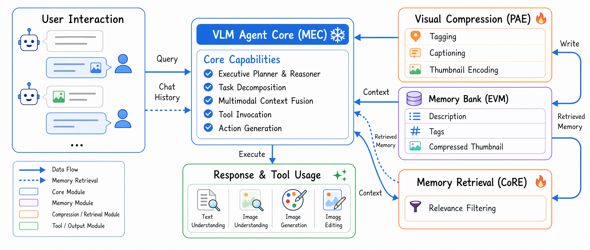
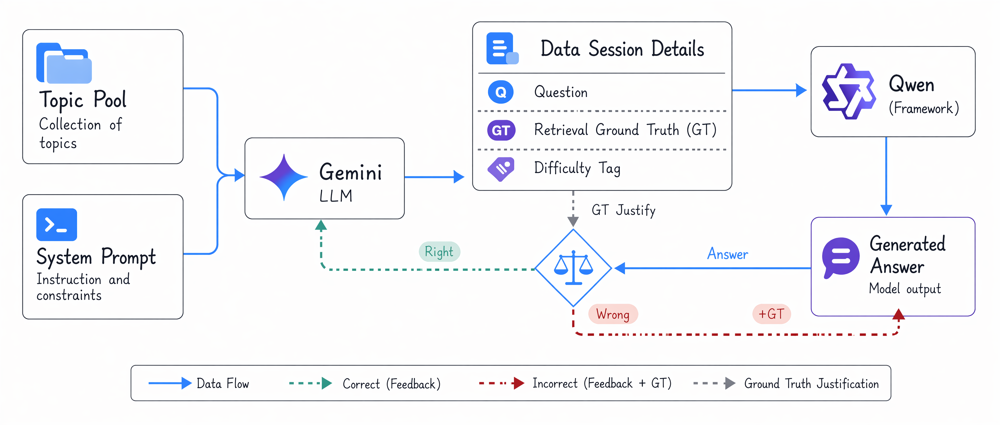

# Cognitive-structured Multimodal Agent

**for Multimodal Understanding, Generation, and Editing**

> Long-horizon multimodal memory, retrieval, generation, and editing.

[**Feng Wang**](https://github.com/caseclose)¹\*, Canmiao Fu², Zhipeng Huang², Chen Li², Jing LYU², Ge Li¹

¹Peking University  ²WeChat Vision, Tencent Inc.

<sub>\*Work done during an internship at WeChat Vision, Tencent Inc.</sub>

<p>
  <a href="https://caseclose.github.io/cma-harness/"></a>
  <a href="https://caseclose.github.io/cma-harness/#demo-gallery"></a>
  <a href="https://caseclose.github.io/cma-harness/#benchmark"></a>
  <a href="https://caseclose.github.io/cma-harness/#bibtex"></a>
</p>

**🌐 Live project page → https://caseclose.github.io/cma-harness/**

---

## TL;DR

We introduce a **memory-centric multimodal agent** that externalizes visual history into
**Episodic Visual Memory**, selectively retrieves relevant visual episodes, and plans
understanding, generation, editing, and composition actions through a
**Multimodal Executive Controller (MEC)**.

## Key Results

| Metric | Value | What it measures |
| --- | --- | --- |
| **91.4%** | Retrieval accuracy | English retrieval over 20-turn sessions (All) |
| **89.4%** | Retrieval accuracy | Long subset (turns 11–20) |
| **82.0%** | Retrieval accuracy | Hard subset (`very_hard` @ turns 11–20) |
| **12.7 s** | Per-turn runtime | ~½ the 32B all-context baseline |
| **8.53 / 10** | Gemini quality score | Chinese overall generation quality |

## Method

A cognitive structure for long-horizon multimodal interaction:

- **Structured visual memory** — incoming and generated images are compressed into
  captions, tags, thumbnails, and metadata, so visual evidence persists without
  repeatedly occupying the model context window.
- **Selective cross-turn retrieval** — the *Cognitive Retrieval Engine* selects only
  the visual episodes relevant to the current user turn, improving grounding while
  reducing visual-token overhead.
- **Executive task control** — the *Multimodal Executive Controller* infers whether a
  turn requires understanding, generation, editing, composition, or pure chat, then
  routes the task accordingly.
- **Training for memory use** — a *Unified Scenario Engine* generates structured
  multi-turn dialogues with retrieval annotations, enabling SFT and RL optimization
  for memory construction and retrieval.

<p align="center">
  
  <br><em>End-to-end pipeline: episodic visual memory, cognitive retrieval engine, and multimodal executive controller.</em>
</p>

## M2CA-Bench

The **Multi-turn Context Agent Benchmark (M2CA-Bench)** is a held-out evaluation set
of **100 sessions × 20 turns (2,000 turns)** designed to stress-test long-horizon
multimodal grounding.

| 2,000 | 100 | 55 | 4 |
| :---: | :---: | :---: | :---: |
| evaluation turns | 20-turn sessions | topics × 8 domains | difficulty strata |

- **Structured scenario representation** — each turn is annotated as
  `(tᵢ, τᵢ, Rᵢ*, dᵢ, fᵢ)`: user input, task type, ground-truth retrieval set,
  difficulty, and challenge tags. Topics span **8 domains** (commercial, industrial,
  educational, public service, hospitality, natural landscape, scientific, space)
  with four task modes per topic — `generate`, `edit`, `cross-reference-edit`,
  `understand`.
- **Four difficulty strata** — stratified by topic shift, temporal span, multi-image
  interaction, and ambiguity:
  - `easy` — same-topic, short-span references
  - `medium` — mid-range recall across turns
  - `hard` — long temporal spans or topic shifts
  - `very_hard` — multi-image comparison, fusion edits, ambiguous references
- **Hard-negative design** — to block shortcut learning we inject
  *high-similarity confounders* (near-duplicate images differing only in color,
  lighting, or material) and *negative retrieval samples* (semantic negatives that
  mention past images conversationally, structural negatives that explicitly request
  a new generation).
- **Three evaluation subsets** — retrieval accuracy is reported on
  **All / Long / Hard** cuts of increasing difficulty.

<p align="center">
  
  <br><em>Unified Scenario Engine — a closed-loop pipeline that produces every M2CA-Bench session with turn-level retrieval supervision.</em>
</p>

## Demo Gallery

Eight interactive multimodal sessions covering search-driven generation, brand-fusion
editing, cross-reference composition, and long-horizon visual recall. Click through
the stacked cards on the [live project page](https://caseclose.github.io/cma-harness/#demo-gallery)
or open individual `.mp4` files under [`assets/demos/`](assets/demos/):

| # | Title |
| :---: | :--- |
| 1 | Brand Logo Fusion |
| 2 | Multi-image Cross-reference Edit |
| 3 | Long-horizon Visual Recall |
| 4 | Cross-modal Retrieval + Generation |
| 5 | Compositional Scene Editing |
| 6 | Style Transfer with Memory |
| 7 | Multi-turn Understanding |
| 8 | Real-time Web Search + Compose |

## CMA-Harness — Tool-Augmented Deployment

CMA-Harness is not a replacement for the core agent; it *wraps* the same
**PAE → EVM → CoRE → MEC** structure and extends it for open-ended, multi-session
workflows. The division of labor is preserved: **PAE** still compresses images into
cards, **EVM** stores long-horizon visual memory, **CoRE** retrieves relevant
episodes, and **MEC** remains the executive controller — only its action space is
broadened from *understand / generate / edit* to a structured registry of callable
tools.

### 🛠 MEC-Driven Tool Registry (17 tools)

The harness exposes an OpenAI-style function-calling interface over a registry of
**17 tools**, each described by a JSON schema, capability blurb,
concurrency-safety flag, and async executor. Tools fall into three groups:

| Group | Tools |
| :--- | :--- |
| **Generation & editing** | text-to-image generation, image editing, multi-image composition, deterministic PIL collage, background removal, watermark removal, cropping, text overlay |
| **Understanding & memory** | image inspection, best-image selection, image retrieval |
| **External information** | web search, batch search, web-image search, web-page fetch, image fetch |

Access is governed by an **MEC action policy**, not exposed as an undifferentiated
toolbox:

- MEC first decides *whether* a tool is needed at all — many requests are best
  answered directly.
- For real-world entities (logos, products, screenshots, named faces), MEC is
  instructed **not** to hallucinate from text: it must first obtain real pixels
  via memory retrieval or web-image fetch, then route the task to
  composition / editing with those image identifiers as visual references.
- **Semantic composition vs. deterministic layout** — diffusion composition fuses
  references into a new scene; a PIL-based collage tool is used when faces, logos,
  captions, dates, or CJK text must be preserved *pixel-faithfully* (posters,
  infographics, timelines, comparison sheets).
- **Concurrency policy** — read-only ops (web search, web fetch, image inspect,
  memory retrieval) run in parallel; mutating / GPU-heavy ops (generation,
  editing, composition, cropping, text render) are serialized for memory
  consistency.
- **Safety rails** — duplicate-call detection prompts MEC to revise its plan;
  a per-turn tool-round budget forces a graceful partial summary when exhausted.

### 🧠 Flexible Persistent Multimodal Memory

EVM is extended from a session-local bank into a **multi-scope persistent memory
system** organized by lifecycle:

| Scope | What it holds |
| :--- | :--- |
| **Session memory** | the current interaction transcript and its visual state |
| **User memory** | durable preferences, feedback, project facts, external references (typed Markdown + auto-refreshed index) |
| **Gallery memory** | reusable visual assets promoted from earlier sessions |
| **Compact summaries** | structured recaps of older turns once a session exceeds token / tool-call thresholds |

**Three-part visual asset.** Every image is stored as
`{ original · thumbnail · image_card(JSON) }`:

- **original** — preserved for future edit, composition, inspection, download
- **thumbnail** — compact preview used for retrieval and UI
- **image card** — semantic tags, short description, color palette, aspect ratio,
  file paths, plus **lifecycle metadata**: parent-child links for edited variants,
  an `is_current` flag for the active deliverable, user feedback marks, and a
  gallery-promotion flag

**Adaptive retrieval** — MEC does not always call CoRE:

1. Deterministic rules resolve obvious references (`"the latest image"`,
   `"the first image"`, explicit indices).
2. A lightweight text prefilter narrows candidates by tag / description / palette /
   recency / feedback.
3. Multimodal retrieval over image cards + thumbnails disambiguates fuzzy
   references (`"the blue one"`, `"the busier layout"`).
4. Full-resolution pixels are loaded *only* after a downstream tool needs them.

**Asynchronous annotation** — new images (uploaded, generated, edited, fetched,
composed) are persisted immediately and returned to the user right away; a
background PAE-style extractor then enriches the image card with tags, description,
and palette — so latency-sensitive interaction is never blocked by visual
abstraction.

**Long-conversation compaction** — instead of replaying an unbounded transcript,
older turns are folded into structured summaries that preserve high-level goals,
established preferences, generated image identifiers, open follow-ups, and current
active state, while the most recent turns stay verbatim.

### 🔁 Interactive Execution Loop

Each user turn is a small event loop driven by MEC:

```
reconstruct memory context  →  rebuild system prompt (memory + tool schemas)
        ↓
MEC reasons over the task
        ↓
[ optional tool call(s), read-only in parallel / mutating serialized ]
        ↓
tool results appended to transcript  →  MEC observes and decides next step
        ↓
iterate until enough evidence  →  final image / text response
```

Intermediate reasoning, tool steps, tool results, and progressive images are
surfaced to the UI as they arrive. Uploaded and produced images are stored as
addressable memory assets, the current deliverable is tracked, so follow-ups like
*"make it brighter"* or *"use the previous poster"* resolve without re-attaching
every historical image.

**Reference instantiation.** The current deployment uses **Qwen3.5-122B-A10B** as
the MEC planner, **Qwen-Image-2512** for text-to-image, and **Qwen-Image-Edit-2511**
for editing / multi-image composition. Generation and editing prompts are
auto-expanded (richer visual descriptions for generation; locality + object
grounding + unrelated-region preservation for editing). These are instantiation
choices — the harness architecture does not depend on any specific model.

## Citation

```bibtex
@article{wang2026cognitive,
  title   = {Cognitive-structured Multimodal Agent for Multimodal Understanding, Generation, and Editing},
  author  = {Wang, Feng and Fu, Canmiao and Huang, Zhipeng and Li, Chen and LYU, Jing and Li, Ge},
  journal = {arXiv preprint},
  year    = {2026}
}
```
