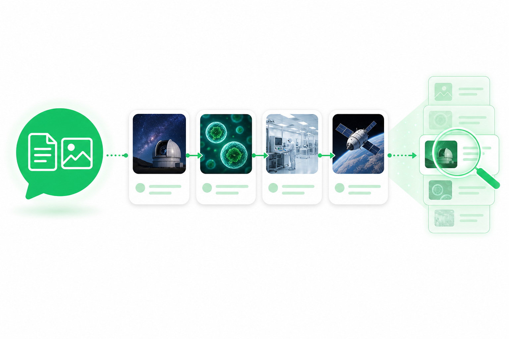
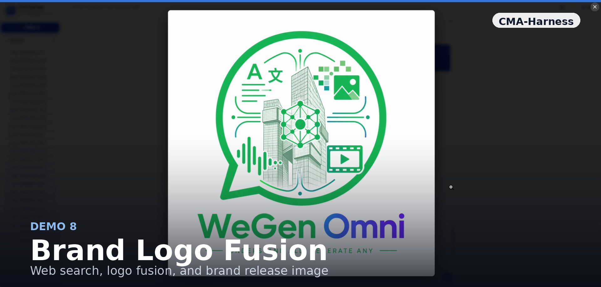
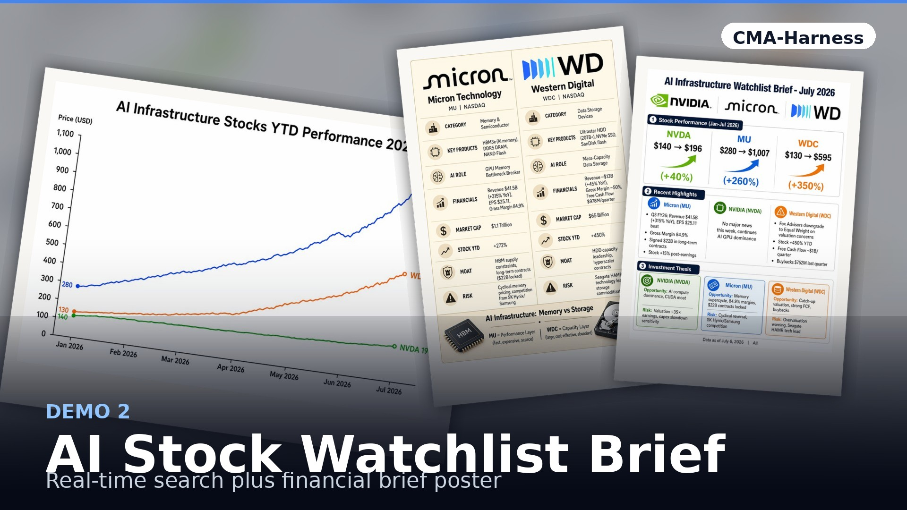
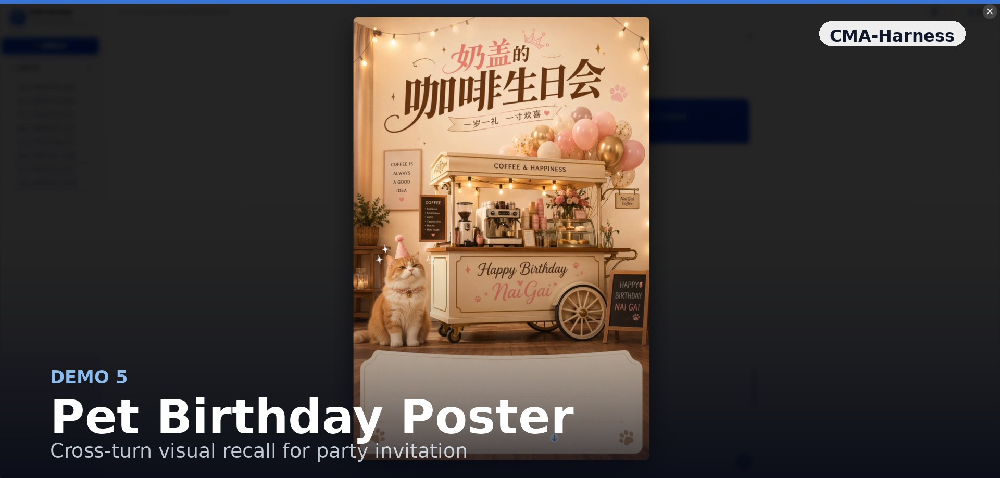
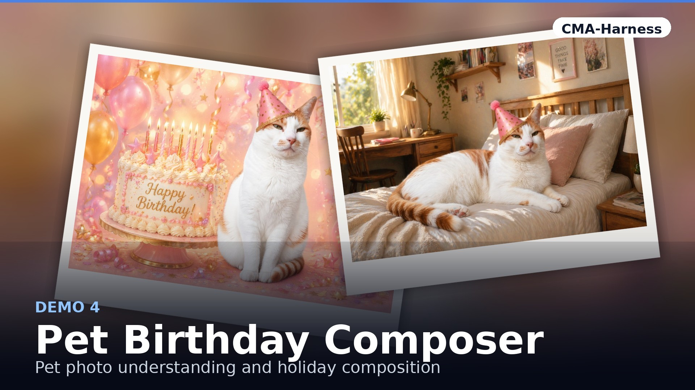
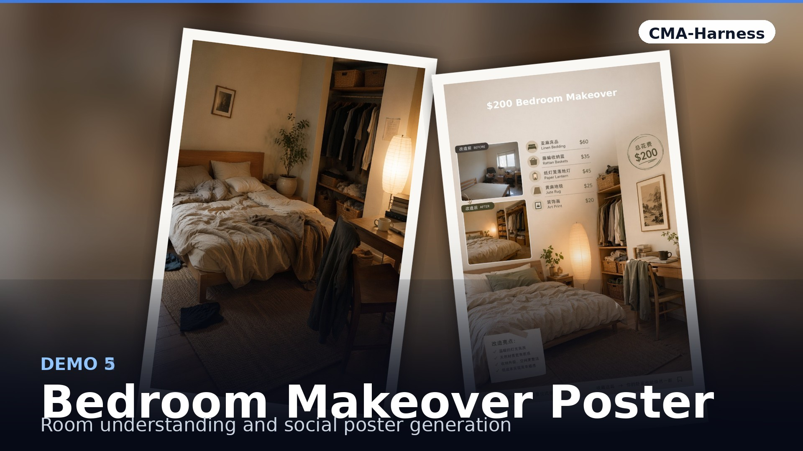

<div align="center">



# Cognitive-structured Multimodal Agent

### <sub>for Multimodal Understanding, Generation, and Editing</sub>

*Long-horizon multimodal memory, retrieval, generation, and editing — with a tool-augmented deployment harness (**CMA-Harness**).*

<p>
  <a href="mailto:fengwang@stu.pku.edu.cn"><b>Feng Wang</b></a><sup>1</sup>*&nbsp;&nbsp;
  Canmiao Fu<sup>2</sup>&nbsp;&nbsp;
  Zhipeng Huang<sup>2</sup>&nbsp;&nbsp;
  Chen Li<sup>2</sup>&nbsp;&nbsp;
  Jing LYU<sup>2</sup>&nbsp;&nbsp;
  Ge Li<sup>1</sup>
</p>

<p>
  <sup>1</sup>Peking University&nbsp;&nbsp;&nbsp;<sup>2</sup>WeChat Vision, Tencent Inc.
</p>

<sub>*Work done during an internship at WeChat Vision, Tencent Inc.</sub>

<p>
  <a href="https://caseclose.github.io/cma-harness/"></a>
  <a href="https://caseclose.github.io/cma-harness/#demo-gallery"></a>
  <a href="https://caseclose.github.io/cma-harness/#benchmark"></a>
  <a href="mailto:fengwang@stu.pku.edu.cn"></a>
</p>

<b>🌐 Project page → <a href="https://caseclose.github.io/cma-harness/">caseclose.github.io/cma-harness</a></b>

</div>

---

## TL;DR

We introduce a **memory-centric multimodal agent** that externalizes visual history
into **Episodic Visual Memory (EVM)**, selectively retrieves relevant visual
episodes, and plans understanding, generation, editing, and composition actions
through a **Multimodal Executive Controller (MEC)**. The same cognitive structure is
instantiated as **CMA-Harness**, a tool-augmented, multi-session deployment.

## Key Results

| Metric | Value | What it measures |
| --- | --- | --- |
| **91.4%** | Retrieval accuracy | English retrieval over 20-turn sessions (All) |
| **89.4%** | Retrieval accuracy | Long subset (turns 11–20) |
| **82.0%** | Retrieval accuracy | Hard subset (`very_hard` @ turns 11–20) |
| **12.7 s** | Per-turn runtime | ~½ the 32B all-context baseline |
| **8.53 / 10** | Gemini quality score | Chinese overall generation quality |

## Method

A cognitive structure for long-horizon multimodal interaction:

- **Structured visual memory** — incoming and generated images are compressed into
  captions, tags, thumbnails, and metadata, so visual evidence persists without
  repeatedly occupying the model context window.
- **Selective cross-turn retrieval** — the *Cognitive Retrieval Engine (CoRE)*
  selects only the visual episodes relevant to the current user turn, improving
  grounding while reducing visual-token overhead.
- **Executive task control** — the *Multimodal Executive Controller (MEC)* infers
  whether a turn requires understanding, generation, editing, composition, or pure
  chat, then routes the task accordingly.
- **Training for memory use** — a *Unified Scenario Engine* generates structured
  multi-turn dialogues with retrieval annotations, enabling SFT and RL optimization
  for memory construction and retrieval.

## M2CA-Bench

The **Multi-turn Context Agent Benchmark (M2CA-Bench)** is a held-out evaluation set
of **100 sessions × 20 turns (2,000 turns)** designed to stress-test long-horizon
multimodal grounding.

| 2,000 | 100 | 55 | 4 |
| :---: | :---: | :---: | :---: |
| evaluation turns | 20-turn sessions | topics × 8 domains | difficulty strata |

- **Structured scenario representation** — each turn is annotated as
  `(tᵢ, τᵢ, Rᵢ*, dᵢ, fᵢ)`: user input, task type, ground-truth retrieval set,
  difficulty, and challenge tags. Topics span **8 domains** with four task modes per
  topic — `generate`, `edit`, `cross-reference-edit`, `understand`.
- **Four difficulty strata** — stratified by topic shift, temporal span, multi-image
  interaction, and ambiguity (`easy` / `medium` / `hard` / `very_hard`).
- **Hard-negative design** — *high-similarity confounders* (near-duplicate images
  differing only in color, lighting, or material) and *negative retrieval samples*
  (semantic and structural negatives) block shortcut learning.
- **Three evaluation subsets** — retrieval accuracy is reported on **All / Long /
  Hard** cuts of increasing difficulty.

## Demos

Interactive multimodal sessions — search-driven generation, brand-fusion editing,
cross-reference composition, and long-horizon visual recall. **Click any thumbnail to
watch it play on the [live project page](https://caseclose.github.io/cma-harness/#demo-gallery).**

<div align="center">
<table>
<tr>
<td><a href="https://caseclose.github.io/cma-harness/#demo-gallery"></a></td>
<td><a href="https://caseclose.github.io/cma-harness/#demo-gallery"></a></td>
<td><a href="https://caseclose.github.io/cma-harness/#demo-gallery"></a></td>
<td><a href="https://caseclose.github.io/cma-harness/#demo-gallery"></a></td>
</tr>
<tr>
<td><a href="https://caseclose.github.io/cma-harness/#demo-gallery"></a></td>
<td><a href="https://caseclose.github.io/cma-harness/#demo-gallery"></a></td>
<td><a href="https://caseclose.github.io/cma-harness/#demo-gallery"></a></td>
<td><a href="https://caseclose.github.io/cma-harness/#demo-gallery"></a></td>
</tr>
</table>
</div>

## Citation

If you find this work useful, please consider citing:

```bibtex
@article{wang2026cognitive,
  title   = {Cognitive-structured Multimodal Agent for Multimodal Understanding, Generation, and Editing},
  author  = {Wang, Feng and Fu, Canmiao and Huang, Zhipeng and Li, Chen and LYU, Jing and Li, Ge},
  journal = {arXiv preprint},
  year    = {2026}
}
```

---

<div align="center">

📦 **The code and M2CA-Bench dataset will be released here soon — ⭐ star / 👀 watch to be notified.**

</div>
