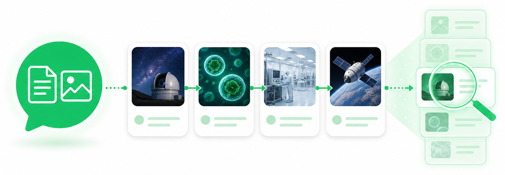
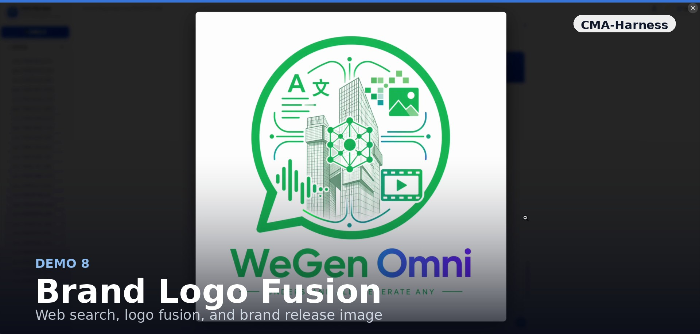
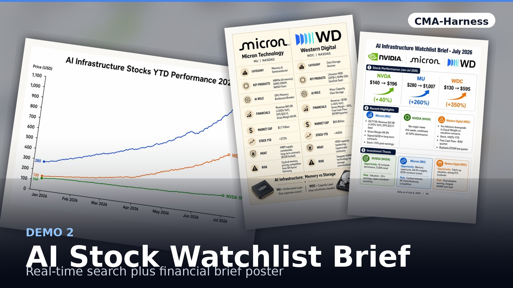
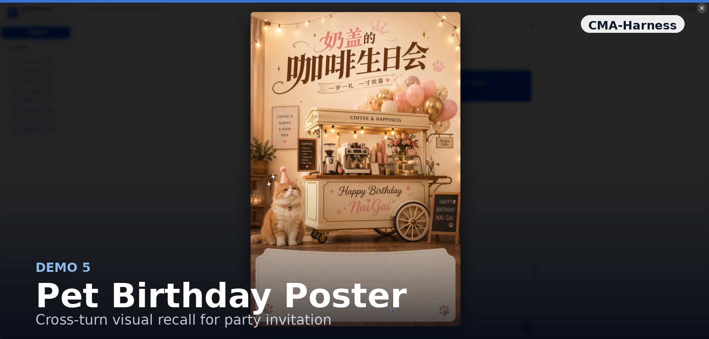
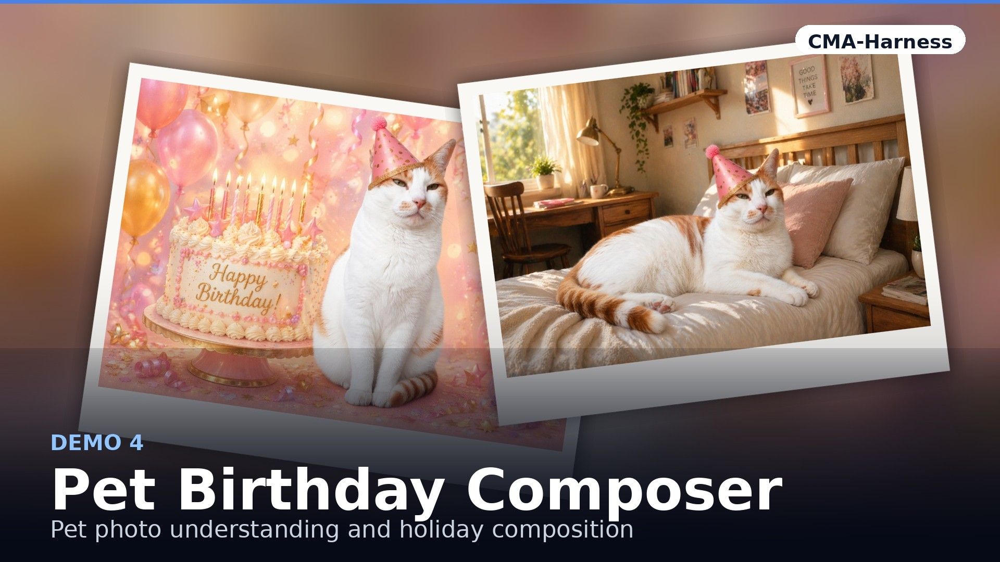
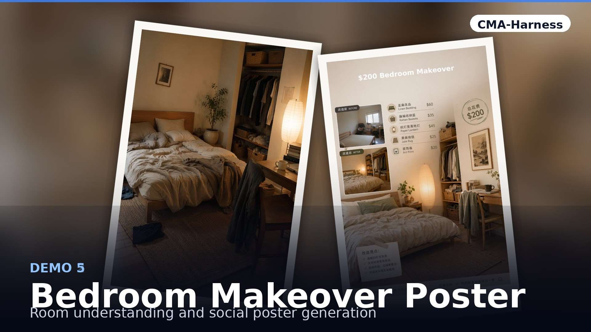
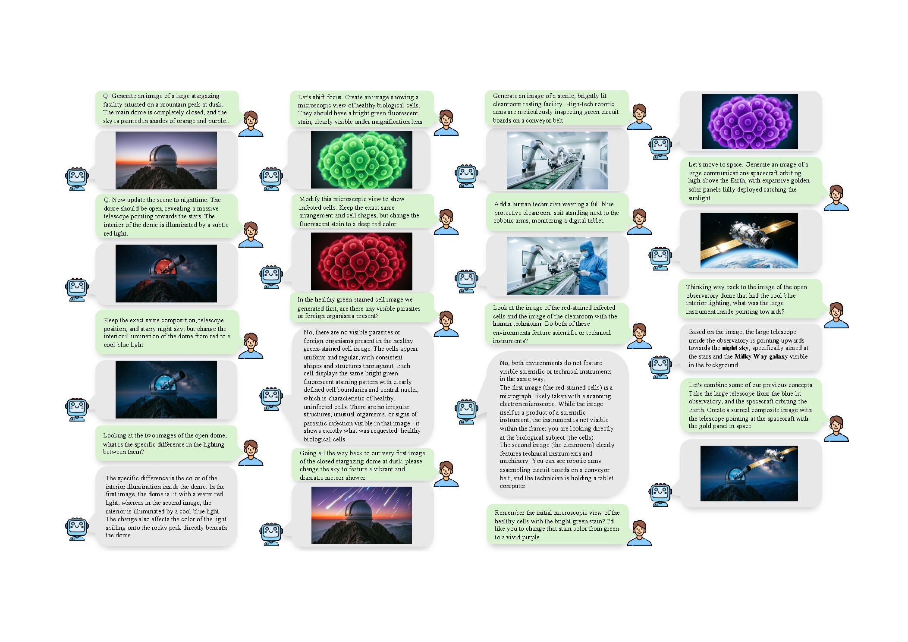
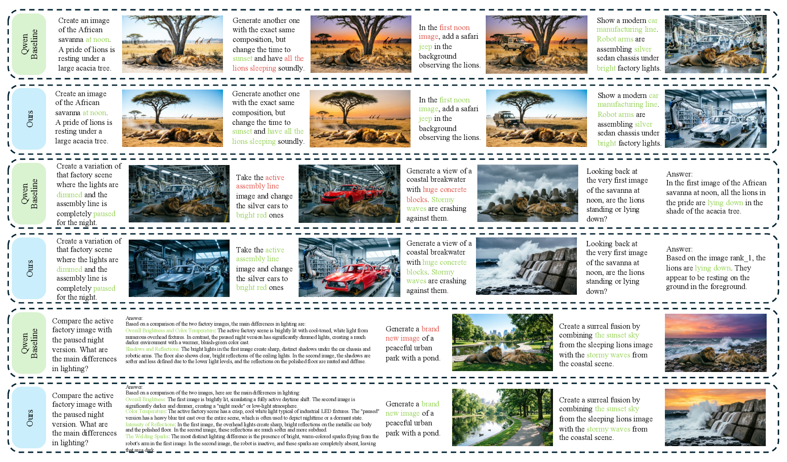
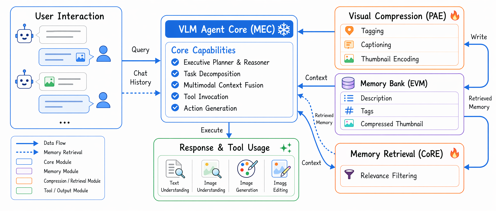
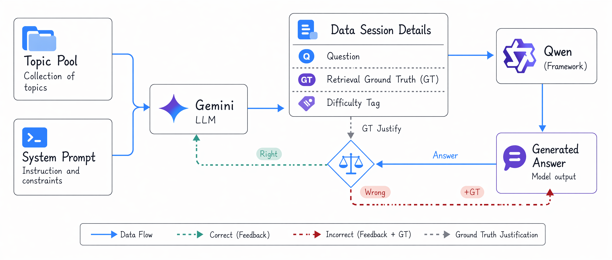

<div align="center">

# Cognitive-structured Multimodal Agent

**for Multimodal Understanding, Generation, and Editing**

<sub>Long-horizon multimodal memory, retrieval, generation, and editing — with a tool-augmented deployment harness (**CMA-Harness**).</sub>

<br>

<a href="mailto:fengwang@stu.pku.edu.cn"><b>Feng Wang</b></a><sup>1,*</sup>&ensp;
Canmiao Fu<sup>2</sup>&ensp;
Zhipeng Huang<sup>2</sup>&ensp;
Chen Li<sup>2</sup>&ensp;
Jing LYU<sup>2</sup>&ensp;
Ge Li<sup>1</sup>

<sup>1</sup> Peking University &emsp; <sup>2</sup> WeChat Vision, Tencent Inc.

<sub>* Work done during an internship at WeChat Vision, Tencent Inc.</sub>

<br>

<a href="https://arxiv.org/abs/2607.08497"></a>
<a href="https://caseclose.github.io/cma-harness/"></a>
<a href="https://caseclose.github.io/cma-harness/#demo-gallery"></a>
<a href="https://caseclose.github.io/cma-harness/#benchmark"></a>

</div>

<table>
<tr>
<td width="92" align="center" valign="middle">
  
</td>
<td valign="middle">


**Adapted parts of this architecture have been rolled out to WeChat Xiaowei Agent for gray-scale testing.**

<sub>该架构经调整的部分内容已上线到微信小微Agent中进行灰测。</sub>

</td>
</tr>
</table>

<p align="center">
  <a href="https://caseclose.github.io/cma-harness/"><b>Project page</b></a>
  &nbsp;·&nbsp;
  <a href="https://arxiv.org/abs/2607.08497"><b>Paper</b></a>
  &nbsp;·&nbsp;
  <a href="https://caseclose.github.io/cma-harness/#demo-gallery"><b>Demo</b></a>
  &nbsp;·&nbsp;
  <a href="#citation"><b>Citation</b></a>
</p>

---

## TL;DR

We introduce a **memory-centric multimodal agent** that externalizes visual history into **Episodic Visual Memory (EVM)**, selectively retrieves relevant visual episodes, and plans understanding, generation, editing, and composition actions through a **Multimodal Executive Controller (MEC)**. The same cognitive structure is instantiated as **CMA-Harness**, a tool-augmented, multi-session deployment.



## Key Results

<div align="center">

| **91.4%** | **89.4%** | **82.0%** | **12.7 s** | **8.53 / 10** |
| :---: | :---: | :---: | :---: | :---: |
| All · retrieval | Long · turns 11–20 | Hard · very_hard | Per-turn runtime | Gemini quality |
| 20-turn English sessions | Extended memory | Hardest long-span cut | ~½ of 32B all-context | Chinese generation |

</div>

## Demos

Interactive multimodal sessions — search-driven generation, brand-fusion editing, cross-reference composition, and long-horizon visual recall.

**Click any thumbnail to watch it on the [live project page](https://caseclose.github.io/cma-harness/#demo-gallery).**

<div align="center">

<table>
<tr>
<td align="center" width="25%"><a href="https://caseclose.github.io/cma-harness/#demo-gallery"></a><br><sub><b>Brand Logo Fusion</b></sub></td>
<td align="center" width="25%"><a href="https://caseclose.github.io/cma-harness/#demo-gallery"></a><br><sub><b>AI Stock Watchlist</b></sub></td>
<td align="center" width="25%"><a href="https://caseclose.github.io/cma-harness/#demo-gallery"></a><br><sub><b>Pet Birthday Poster</b></sub></td>
<td align="center" width="25%"><a href="https://caseclose.github.io/cma-harness/#demo-gallery"></a><br><sub><b>Pet Birthday Composer</b></sub></td>
</tr>
<tr>
<td align="center"><a href="https://caseclose.github.io/cma-harness/#demo-gallery"></a><br><sub><b>Bedroom Makeover</b></sub></td>
<td align="center"><a href="https://caseclose.github.io/cma-harness/#demo-gallery"></a><br><sub><b>Weeknight Recipe</b></sub></td>
<td align="center"><a href="https://caseclose.github.io/cma-harness/#demo-gallery"></a><br><sub><b>Bedroom Refresh</b></sub></td>
<td align="center"><a href="https://caseclose.github.io/cma-harness/#demo-gallery"></a><br><sub><b>Listing Studio</b></sub></td>
</tr>
</table>

</div>

### Qualitative cases

<div align="center">



<sub><b>A full multi-turn session.</b> Branching dialogue spanning generation, editing, cross-reference composition, and long-horizon visual recall.</sub>

<br><br>



<sub><b>Qualitative comparison.</b> CMA (Ours) vs. an all-context baseline on cross-turn grounding, consistent editing, and long-range recall.</sub>

</div>

## Method

A cognitive structure for long-horizon multimodal interaction:



- **Structured visual memory** — incoming and generated images are compressed into captions, tags, thumbnails, and metadata, so visual evidence persists without repeatedly occupying the model context window.
- **Selective cross-turn retrieval** — the *Cognitive Retrieval Engine (CoRE)* selects only the visual episodes relevant to the current user turn, improving grounding while reducing visual-token overhead.
- **Executive task control** — the *Multimodal Executive Controller (MEC)* infers whether a turn requires understanding, generation, editing, composition, or pure chat, then routes the task accordingly.
- **Training for memory use** — a *Unified Scenario Engine* generates structured multi-turn dialogues with retrieval annotations, enabling SFT and RL optimization for memory construction and retrieval.

## M2CA-Bench

The **Multi-turn Context Agent Benchmark (M2CA-Bench)** is a held-out evaluation set of **100 sessions × 20 turns (2,000 turns)** designed to stress-test long-horizon multimodal grounding.

<div align="center">

| **2,000** | **100** | **55** | **4** |
| :---: | :---: | :---: | :---: |
| evaluation turns | 20-turn sessions | topics × 8 domains | difficulty strata |

</div>



- **Structured scenario representation** — each turn is annotated as `(tᵢ, τᵢ, Rᵢ*, dᵢ, fᵢ)`: user input, task type, ground-truth retrieval set, difficulty, and challenge tags. Topics span **8 domains** with four task modes per topic — `generate`, `edit`, `cross-reference-edit`, `understand`.
- **Four difficulty strata** — stratified by topic shift, temporal span, multi-image interaction, and ambiguity (`easy` / `medium` / `hard` / `very_hard`).
- **Hard-negative design** — *high-similarity confounders* (near-duplicate images differing only in color, lighting, or material) and *negative retrieval samples* (semantic and structural negatives) block shortcut learning.
- **Three evaluation subsets** — retrieval accuracy is reported on **All / Long / Hard** cuts of increasing difficulty.

## Citation

If you find this work useful, please consider citing:

```bibtex
@article{wang2026cognitive,
  title   = {Cognitive-structured Multimodal Agent for Multimodal Understanding, Generation, and Editing},
  author  = {Wang, Feng and Fu, Canmiao and Huang, Zhipeng and Li, Chen and LYU, Jing and Li, Ge},
  journal = {arXiv preprint arXiv:2607.08497},
  year    = {2026},
  eprint  = {2607.08497},
  archivePrefix = {arXiv},
  primaryClass = {cs.CV}
}
```

---

<div align="center">

The code and M2CA-Bench dataset will be released here soon.

⭐ Star or 👀 watch this repository to get notified.

</div>
